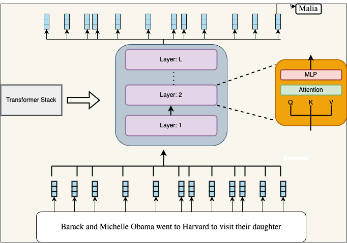
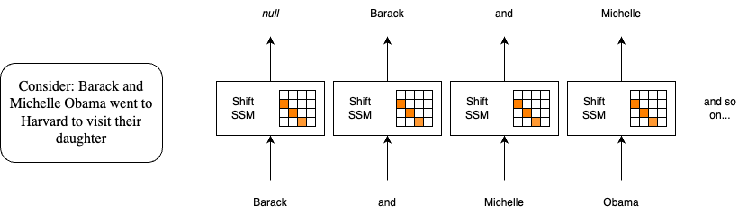

<div align="center">
  
</div>

# Presentation: Hungry Hungry Hippos: Towards Language Modeling with State Space Models
By Sarah Auch

## Introduction

Welcome to an introduction on "Hungry Hungry Hippos: Towards Language Modeling with State Space Models." This research investigates whether the attention mechanisms in transformers, which are central to models like ChatGPT, Claude, and Co-Pilot, can be replaced by alternative computational methods. Specifically, the study examines the viability of using State Space Models (SSMs) as a substitute, aiming to maintain or even enhance transformers' performance in tasks that require long-range dependencies.

### "We are interested in seeing if we can start to replace attention with some other primitives that do not grow quadratically in the sequence length" - Daniel Y. Fu

This project addresses several computational bottlenecks presented by the attention mechanism. Transformers have revolutionized natural language processing, yet they face significant challenges, especially with high computational and memory costs that grow quadratically with sequence length. Each additional token in a sequence demands increased processing power and memory, slowing performance and escalating operational expenses. Transformers also struggle with long contexts, often forcing truncation and risking the loss of crucial information. Additionally, the high energy demands of transformers raise concerns about environmental and accessibility implications.

The H3 project proposes SSMs as an alternative to attention. Unlike attention mechanisms, SSMs are well-suited for efficiently handling continuous sequential data, especially in fields like time series analysis and control systems, without the same computational overhead. By implementing SSMs, the H3 project seeks to preserve the language modeling capabilities of transformers while significantly reducing computational costs.

## Motivation

The aim to expand the context length of our model. However, increasing it twofold—for example, from 32k to 64k tokens—is not simply twice as expensive; it’s actually four times as costly.

### Why? 
In a transformer model, each token in the context window doesn’t operate independently—it "pays attention" to all other tokens to understand relationships and context. This means each token must connect with every other token in the window, creating a dense network of interactions that grows with the number of tokens. Doubling the number of tokens doesn’t just double these interactions; it quadruples them. For instance, increasing the tokens from 4 to 8 results in interactions jumping from 16 to 64, thereby quadrupling the processing cost. This exponential increase in interactions is what drives up computational costs significantly as we expand context length.

### Illistration of the Quadratic Complexity Problem:

<div align="center">
  
</div>

Figure 1: Transformer Langage Models from #4 - Hungry Hungry Hippos: Towards Language Modeling with State Space Models

<div align="center">
  
</div>
Figure 2: Attention: Quadratic Context Bottleneck from #4 - Hungry Hungry Hippos: Towards Language Modeling with State Space Models


### ... This is just one layer...

### Self-Attention Complexity Analysis

- **Sequence length**: \( n \) tokens
- **Self-attention complexity**: \( O(n^2) \)

If there are \( h \) attention heads:
- **Each head**: \( O(n^2) \)
- **Total per layer**: \( h * O(n^2) \)

### Across All Layers
- **Number of layers**: \( L \)
- **Total complexity**: \( L * h * O(n^2) \)

Memory requirements grow with \( L * h * n^2 \).


## What is the solution?

### State Space Models (SSMs)

State Space Models (SSMs) have proven effective for modeling sequences like audio data and time series, demonstrating their potential for sequential tasks. While SSMs offer attractive properties like linear scaling and infinite context during generation, previous SSM architectures faced two key challenges:


Pros:
- During training: O(NlogN) in sequence length
- During Generation: No need to process the whole input and no constraight to Context Length

Cons:
Performance Gap:
- Underperform compared to Transformers on language tasks
- Example: Several perplexity points worse than attention on language modeling
- Existing SSMs (like S4D, GSS) struggled with token comparison and recall

Speed Issues:
- Despite theoretical efficiency, slower than Transformers in practice
- Poor hardware utilization on modern GPUs
- Particularly inefficient for shorter sequences
- FFT operations don't leverage specialized hardware (like tensor cores)


Recurrent View:
For Generation:
Continuous-time SSM:
```
# Differential equations:
ẋ(t) = Ax(t) + Bu(t)    # State equation
y(t) = Cx(t) + Du(t)    # Output equation

Where:
- x(t) is state variable (dimension m)
- u(t) is input signal
- y(t) is output signal  
- t represents continuous time
```

Discrete-time SSM
```
# Difference equations:
xi = Axi-1 + Bui    # State update
yi = Cxi + Dui      # Output computation

Where:
- xi is state at step i
- ui is input at step i
- yi is output at step i
```

Basic Structure:
- Usually run d parallel SSMs (one per hidden dimension)
- Each SSM learns its own A, B, C, D matrices
- State variable x acts as memory, tracking sequence history

```
Convolutional View:
For Trainning:
# SSM as Convolution:
f = [CB, CAB, CA²B, ..., CA^(N-1)B]  # Create filter
y = f * u + Du  # Convolve filter with input

# Efficient Implementation:
- Use Fast Fourier Transforms (FFT)
- Complexity: O(N log N) vs O(N²)
- Steps:
  1. Take FFT of filter f
  2. Take FFT of input u
  3. Multiply results pointwise
  4. Take inverse FFT
```

### Addressing the Performance Gap with the H3 layer

State Space Models have traditionally failed to perform as well on language modeling tasks. The research examined two specific synthetic tasks designed to test certain capabilities:

1. **Ability to Remember Tokens After an Event**  
   - **Task**: "Induction Head"  
   - **Example**: Given a sequence where a special token appears, the model needs to recall what token came immediately after that special token when it appeared earlier in the sequence
   - **Purpose**: This tests the model's ability to "log" or remember specific tokens based on their relationship to a trigger event.
  
2. **Ability to Compare Tokens Across a Sequence**  
   - **Task**: "Associative Recall"  
   - **Example**: Given a sequence of key-value pairs (e.g., "a 2 c 4 b 3 d 1") and then a key, the model must recall the corresponding value.  
   - **Purpose**: This tests the model's ability to:
     - Compare tokens (to find matching keys)
     - Remember associations between token pairs
     - Retrieve the correct value when the key is seen again

### How Attention Mechanisms Naturally Address These Capabilities
Attention has inherent mechanisms to manage both tasks:

- **Token Comparison**: Achieved through the quadratic attention matrix \( QK^T \)
- **Direct Recall**: Accomplished by multiplying \( softmax(QK^T) \) with \( V \)

### Performance of Traditional SSMs
Traditional SSMs struggled on these tasks:
- S4D achieved **35.6% on Induction Head** and **86% on Associative Recall**.

## Introducing the H3 Model
The H3 model was designed to address these challenges, achieving:
- **100% on Induction Head**
- **99.8% on Associative Recall**

### H3 Layer

<div align="center">
  
</div>
Figure 3: Hunger Hunger Hippos:Design for Associative Recall from #4 - Hungry Hungry Hippos: Towards Language Modeling with State Space Models


### Shifft SSM

Acts like a sliding window over recent tokens, providing short-term, local memory.

#### Properties
- **Uses shift matrix A**: Moves elements down by 1
- **Example**: `[a,b,c] -> [0,a,b]`
- **Creates local "memory"**: Retains a record of recent tokens

#### Purpose
- Looks at **local context**
- Tracks **recently appeared tokens**
- Functions as **short-term memory**

<div align="center">
  
</div>

Figure 4: The shift Remembers Prevous Token from #4 - Hungry Hungry Hippos: Towards Language Modeling with State Space Models

### Diagonal SSM

Acts as persistent memory across the entire sequence, providing long-term, global memory.

#### Properties
- **Uses diagonal matrix A**: Maintains information over long distances
- **Can remember tokens**: From the beginning of the sequence

#### Purpose
- Tracks **global context**
- Provides **long-term memory storage**
- Retains information across the **entire sequence length**

### Combining Both Types of Memory

1. **Shift SSM (Local)**:
   - "I just saw token X"
   - Short-term pattern detection

2. **Diagonal SSM (Global)**:
   - "I remember seeing X earlier"
   - Long-term information storage

#### This Combination Enables
- **Short-term token tracking**
- **Long-term memory retention**
- **Both local and global pattern recognition**


### Multiplicative Interactions Between SSMs (K⊙V)

#### 1. First Multiplicative Interaction: SSMshift(K) ⊙ V
- **Purpose**: Gates which values get stored in memory
  - Functions like saying "when I see key K, store value V"
  - Enables local pattern detection and value storage

- **Example for "a 2 b 3"**:
  - **SSMshift(K)**: Tracks when we see 'a'
  - **Multiplication with V**: Stores '2' when 'a' appears

#### 2. After Diagonal SSM (Q⊙)
- **Purpose**: Compares current token with stored memory
  - Functions like asking "does the current token match what's in memory?"
  - Controls when to output stored values

- **Example for "a 2 b 3 a ?"**:
  - **Q**: Represents the current token 'a'
  - **Multiplication**: Checks if 'a' matches stored keys
  - If a match is found, outputs the corresponding stored value '2'

### Together in H3

#### Complete Flow:
1. **SSMshift(K) ⊙ V** - Stores values when keys appear
2. **SSMdiag(...)** - Maintains stored values in memory
3. **Q ⊙ [output]** - Retrieves values when matching keys appear

#### Final Output:
- `Final output = Q ⊙ SSMdiag(SSMshift(K) ⊙ V)`


### A simple example in action

<div align="center">
  
</div>
<div align="center">
  
</div>

Figure 4: How H3 Can Solve Associative Recall from #4 - Hungry Hungry Hippos: Towards Language Modeling with State Space Models


## Evaluating 

Evaluation of 2-layer models on synthetic language tasks.

| Task               | Random | S4D  | Gated State Spaces | H3   | Attention |
|--------------------|--------|------|---------------------|------|-----------|
| Induction Head    | 5.0    | 35.6 | 6.8                 | 100.0| 100.0     |
| Associative Recall| 25.0   | 86.0 | 78.0                | 99.8 | 100.0     |

Tabel 1: From Hungry Hungry Hippos: Towards Language Modeling with State Space Models page 4

### Perplexity of SSM Variants Compared to Transformers on OpenWebText

All models have 12 layers, with a size around 125M, and are trained with the same hyperparameters for 50B tokens.

| Model                | Perplexity |
|----------------------|------------|
| H3                   | 21.0       |
| H3 Hybrid (2 Attn)   | 19.6       |
| S4D                  | 24.9       |
| GSS                  | 24.0       |
| GSS Hybrid (2 Attn)  | 19.8       |
| Transformer          | 20.6       |
Tabel 2: From Hungry Hungry Hippos: Towards Language Modeling with State Space Models page 6


### Hybrid H3-Attention Language Models

Key takeaway: Hybrid H3-Attention Language Models found evidence that attention is not required at every layer to perform similarly to or even outperform traditional transformer models

<div align="center">
  
</div>


## What about the Speed Issues?


## Efficient Training and Inference

While state space models (SSMs) scale nearly linearly with sequence length compared to the quadratic complexity of attention, existing SSM implementations still suffer from poor hardware utilization. **H3** introduces **FlashConv**, a hierarchical algorithm for computing SSMs that significantly improves training and inference speed through two key innovations:

### Fused Block FFTConv

For sequences up to length 8K, FlashConv employs a fused block FFT algorithm that dramatically enhances hardware efficiency:

1. **Kernel Fusion**: The algorithm fuses the FFT, pointwise multiply, and inverse FFT operations into a single kernel to minimize costly GPU memory operations, reducing intermediate reads/writes that typically dominate runtime.

2. **Block FFT**: FFT computation is decomposed into block-diagonal matrix multiplications interleaved with permutations, leveraging specialized matrix multiplication units (e.g., tensor cores on modern GPUs). This provides substantial speedups over standard FFT implementations.

The block FFT algorithm achieves \(O(Nr \log N / \log r)\) FLOPs for sequence length \(N\) when \(N\) can be written as \(r^p\). Although this requires more operations than the standard \(O(N \log N)\) FFT, it achieves faster performance in practice through hardware-accelerated matrix operations.

### State-Passing for Long Sequences

For sequences longer than 8K that exceed GPU SRAM capacity, H3 employs a novel state-passing algorithm that:

1. Splits input sequences into chunks of maximum size \(N'\) that fit in SRAM.
2. Processes each chunk using the efficient block FFTConv.
3. Maintains a recurrent state between chunks to preserve sequence continuity.
4. Updates states efficiently using specialized matrix operations.

This method enables scaling to arbitrary sequence lengths while maintaining near-linear computational complexity. The state-passing algorithm leverages the recurrent properties of SSMs to process long sequences chunk-by-chunk without sacrificing model capability.

### Performance Results

FlashConv delivers substantial speed improvements across multiple benchmarks:

- **2x faster** than previous SSM implementations on the Long Range Arena benchmark.
- **4-8x faster** training compared to attention for long sequences.
- **2.4x faster** text generation in hybrid H3-attention models versus Transformer baselines.
- Maintains **near-linear scaling** with sequence length, even for very long sequences.

These efficiency gains were essential in scaling H3 to billion-parameter models. The optimized FFT computations and intelligent memory management make H3 a practical alternative to attention-based architectures for long-sequence modeling.

The implementation achieves these speedups while preserving the theoretical advantages of SSMs. The algorithms are crafted to maximize hardware utilization on modern accelerators, ensuring numerical stability and accuracy.


## What does a H3 model have to do with the classic childhood game Hungry Hungry Hippos?
Just like those hungry hippos snapping up marbles in a nonstop stream, the H3 model is built to "devour" long sequences of text with impressive speed and efficiency. Imagine playing Hungry Hungry Hippos—you don’t need to carefully compare each marble to every other marble (which would be painfully slow!); the hippos just keep chomping away in a smooth, continuous motion.

Similarly, while traditional Transformers get bogged down by trying to compare every word to every other word in a sequence (picture having to pair up each marble one by one), H3 tackles text in a more streamlined, seamless way, just like our marble-munching hippos. And just as those hippos never seem to get full, H3 can handle much longer sequences of text without getting computationally “stuffed,” making it a truly hungry model for processing language!


## Sources:

Fu, D. Y. (2023, May 1). #4 - Hungry Hungry Hippos: Towards Language Modeling with State Space Models. YouTube. https://www.youtube.com/watch?v=TkOSKrlpnU4 

Fu, D. Y., Dao, T., Saabz, K. K., Thomas, A. W., Rudra, A., & Re, C. (2023, April 29). Hungry Hungry Hippos: Towards Language Modeling with State Space Models. https://arxiv.org/pdf/2212.14052 


